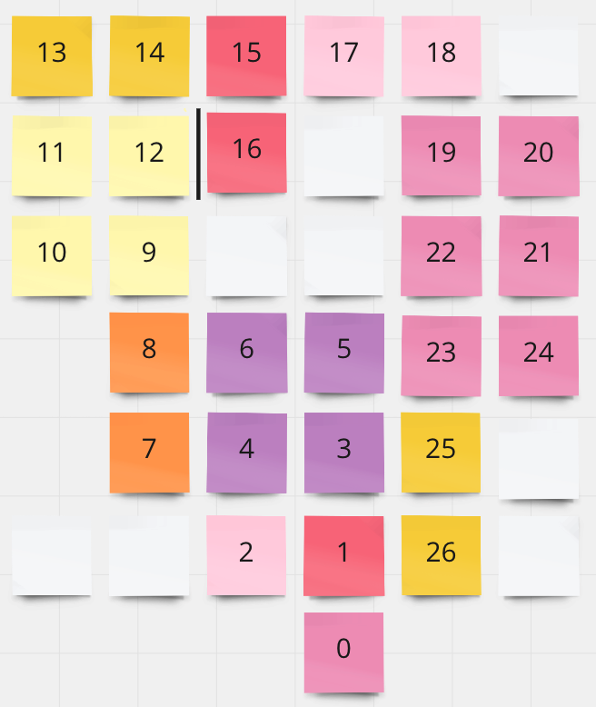

# Assignment 4 from the Developer Academy 

## Assignment Instructions
Let users move through rooms based on user input and get descriptions of each room. 

__Key points__:
 - establish the direction in which the player can move
 - set a way to track how far the user has moved (and therefore which room they are in)
 - print out a description of the room
 - create walls around rooms and let users know if they can not move in a particular direction

 # Game Information
## Notes
- A general theme and intro text is in place for this game but the room's content has placeholder text and is yet to be fleshed out
- the map shows all the available rooms and their locations. Colours signify that adjacent rooms are related ie South-east corner of a larger space etc. 
- You start the game in room 0

 ## Player backstory
You are a patient at a high tech unknown facility, who has lost their memory. You don't know how you got there or even who you are. The facility appears to have been abandoned in a hurry. As you walk around you discover more facts that just lead to more questions. Will you ever find out who you are or why you are here? What happened to this place and can you find a way out? ...

## MAP  (Spoiler Alert)
|   |   |   |   |   |   |   |   |   |   |   |   |   |   |   |   |   |   |   |   |   |   |   |
|   |   |   |   |   |   |   |   |   |   |   |   |   |   |   |   |   |   |   |   |   |   |   |
|   |   |   |   |   |   |   |   |   |   |   |   |   |   |   |   |   |   |   |   |   |   |   |
|   |   |   |   |   |   |   |   |   |   |   |   |   |   |   |   |   |   |   |   |   |   |   |
|   |   |   |   |   |   |   |   |   |   |   |   |   |   |   |   |   |   |   |   |   |   |   |
|   |   |   |   |   |   |   |   |   |   |   |   |   |   |   |   |   |   |   |   |   |   |   |
|   |   |   |   |   |   |   |   |   |   |   |   |   |   |   |   |   |   |   |   |   |   |   |
|   |   |   |   |   |   |   |   |   |   |   |   |   |   |   |   |   |   |   |   |   |   |   |
|   |   |   |   |   |   |   |   |   |   |   |   |   |   |   |   |   |   |   |   |   |   |   |
|   |   |   |   |   |   |   |   |   |   |   |   |   |   |   |   |   |   |   |   |   |   |   |
|   |   |   |   |   |   |   |   |   |   |   |   |   |   |   |   |   |   |   |   |   |   |   |
|   |   |   |   |   |   |   |   |   |   |   |   |   |   |   |   |   |   |   |   |   |   |   |
|   |   |   |   |   |   |   |   |   |   |   |   |   |   |   |   |   |   |   |   |   |   |   |
|   |   |   |   |   |   |   |   |   |   |   |   |   |   |   |   |   |   |   |   |   |   |   |
|   |   |   |   |   |   |   |   |   |   |   |   |   |   |   |   |   |   |   |   |   |   |   |
|   |   |   |   |   |   |   |   |   |   |   |   |   |   |   |   |   |   |   |   |   |   |   |
|   |   |   |   |   |   |   |   |   |   |   |   |   |   |   |   |   |   |   |   |   |   |   |
|   |   |   |   |   |   |   |   |   |   |   |   |   |   |   |   |   |   |   |   |   |   |   |
|   |   |   |   |   |   |   |   |   |   |   |   |   |   |   |   |   |   |   |   |   |   |   |
\/  \/  \/  \/  \/  \/  \/  \/  \/  \/  \/  \/  \/  \/  \/  \/  \/  \/  \/  \/  \/  \/  \/  \/
